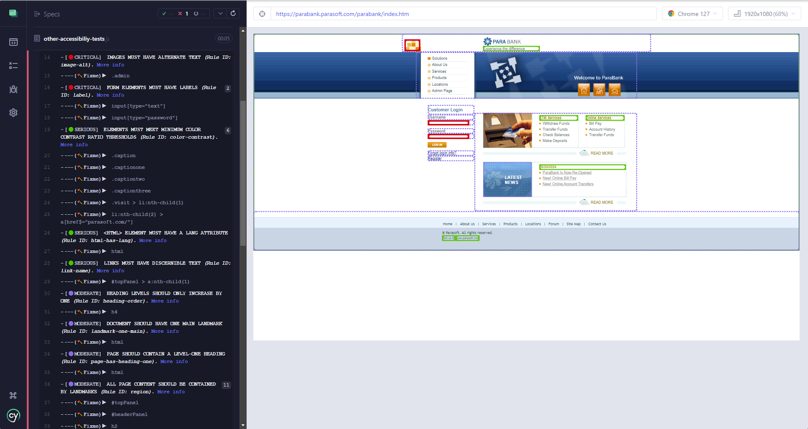
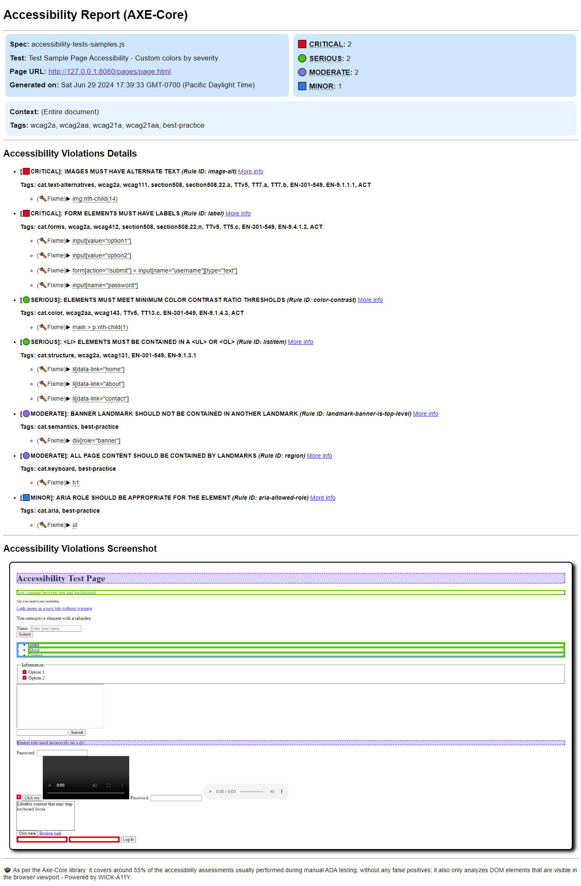

# wick-a11y

**wick-a11y** is a Cypress plugin designed for performing configurable accessibility tests. It allows you to easily incorporate accessibility checks into your End-to-End tests, log detailed information in the Cypress log, and generate HTML documents with screenshots of each violation for easier identification and resolution of accessibility issues, all out-of-the-box


For a detailed guide on setting up and using this plugin to maximize its benefits, please refer to my articles:
  - ["WICK-A11Y Cypress Plugin: Your Unstoppable Ally for Smashing Accessibility Barriers, Cool as John Wick!"](https://dev.to/sebastianclavijo/wick-a11y-cypress-plugin-your-unstoppable-ally-for-smashing-accessibility-barriers-cool-as-john-wick-280a)
  - ["WICK-A11Y "Chapter" 1.2.1 - Voice Support: The Accessibility Cypress Plugin that Talks More Than John Wick in His Movies"](https://dev.to/sebastianclavijo/wick-a11y-v121-voice-the-accessibility-cypress-plugin-that-talks-more-than-john-wick-in-his-movies-8c8)

Or the video:
  - ["WICK-A11Y ACCESSIBILITY PLUGIN VIDEO TUTORIAL"](https://www.youtube.com/watch?v=WpdrXU-6xzc)


## Main Features

- **Comprehensive Accessibility Analysis**: Leverages cypress-axe plugin and axe-core®  for thorough accessibility checks. Axe-core® <https://github.com/dequelabs/axe-core> is a trademark of Deque Systems, Inc. <https://www.deque.com/> in the US and other countries.
  
- **Cypress Command**: Use the custom command `cy.checkAccessibility()` to run checks smoothly.

- **Configurable**:
  - Customize to include specific impact levels (severities), rules, and guidelines.
  - You can separately configure impact levels that will cause the test to fail from those that will serve only as a warning, providing detailed information **(NEW in v1.4.0)**.

- **Summary of Violations**:  Provides a summary for each test in the Cypress Log, detailing accessibility violations categorized by their severity **(NEW in v1.2.0)**.
  
- **Detailed Violation Information**:
  - Displays violations details in the Cypress log and browser console.
  - Graphically shows affected DOM elements on the page, enclosing them in a colored box based on severity.

- **Custom Styling**: Supports custom styling for accessibility issues based on severity level at the test level.

- **Interactive Console**:
  - Hovering over a violation in the Cypress Log highlights the affected DOM element on the page, and clicking it shows detailed issue information in the browser console.
  - Hovering over a DOM element with a violation on the web page in the Cypress runner highlights it graphically and shows a tooltip with the violation information.

- **HTML Reports**: Generates HTML reports with details of the violations and how to fix them, including screenshots for visual reference, all out-of-the-box.

- **Terminal Reports**: Produces terminal reports with details of the violations and how to fix them in tabular form.

- **Voice Support**: Provides audible information for accessibility issues at the suite level, test level, violation type level, and DOM element level, helping users identify issues through voice feedback **(NEW in v1.2.0)**.

> ✔️ **Before launching the accessibility analysis, ensure what you want to analyze is fully rendered on the page.**
> 
> ✔️ **The plugin analyzes DOM elements that are visible in the browser viewport as per the axe-core® plugin (it will not include hidden elements).**


## Installation

```sh
npm install wick-a11y --save-dev
```


## Compatibility

- Compatible with all versions of Cypress v12.0.0 and greater.
- Relies on cypress-axe (≥ 1.5.0) and axe-core® for accessibility analysis.


## Configuration

1. First, in your **`cypress.config.js`** file import `wick-a11y/accessibility-tasks`, and add the line `addAccessibilityTasks(on)` within the **`setupNodeEvents`** function,  to include the accessibility tasks:

```javascript
const { defineConfig } = require("cypress");

// Import the accessibility tasks from wick-a11y plugin
const addAccessibilityTasks = require('wick-a11y/accessibility-tasks');

module.exports = defineConfig({
  e2e: {
    setupNodeEvents(on, config) {
      // Add accessibility tasks
      addAccessibilityTasks(on);
    },
    
    // ... rest of the configuration
  },
});
```

2. Then import the custom commands in your **test file** or your **`cypress/support/e2e.js`** file:

```javascript
import 'wick-a11y';
```

3. 👉 Accessibility HTML reports will be generated in the folder **`cypress/accessibility`** by default. This folder can be changed by including the configuration parameter **`accessibilityFolder`** in **`cypress.config.js`**.

```javascript
module.exports = defineConfig({
  // [...]
  accessibilityFolder: 'cypress/your-accessibility-reports-folder',
  // [...]
});
```

4. 👉 By default, the voice feature is disabled. To enable it, set the Cypress environment variable **`enableAccessibilityVoice`** to **`true`**. This will only take effect when you execute tests in the Cypress runner (`npx cypress open`). You can enable the voice feature by setting this environment variable in three different ways:
    - Including it within the `env` property in the **`cypress.config.js`** file
    
      ```javascript
      module.exports = defineConfig({
            // [...]
            env: {
                  enableAccessibilityVoice: true
            }
            // [...]
      });
      ```
    - Including it in the **`cypress.env.json`** file
    
      ```json
      {
            "enableAccessibilityVoice": true
      }
      ```
    - Providing it as a command line argument `--env` in the terminal when opening the Cypress runner.
    
      ```shell
      npx cypress open --env enableAccessibilityVoice=true
      ```

## API Reference

### cy.checkAccessibility(context, options)

Cypress custom command to check the accessibility of a given context using axe-core®. Only considers DOM elements that are visible on the screen. For details on parameters and options, refer to [Axe-core® Documentation](https://www.deque.com/axe/core-documentation/api-documentation/), [Axe-core® GitHub](https://github.com/dequelabs/axe-core), and [cypress-axe NPM](https://www.npmjs.com/package/cypress-axe).

- **`context`**: (optional) Defines the scope of the analysis. Can be a CSS Selector, a DOM Element, or an Object.
  When **context** is an Object, it could have the properties:
  
  - **`exclude`**: (optional) *From axe-core®* - Elements that should not be tested. Format: CSS Selector or Array of CSS selectors.
  
    E.g.1 `'button'` equivalent to `['button']`.
    
    E.g.2 `'input, .container, [data-cy="submission"]'` equivalent to `['input', '.container', '[data-cy="submission"]']`.

  - **`include`**: (optional) *From axe-core®* - Elements that should be tested. Format: CSS Selector or Array of CSS selectors.
  
    E.g. `'[data-cy="header"]'`
   
  - **`fromFrames`**: (optional) *From axe-core®* - An object with a fromFrames property to specify frames that should be tested.
   
  - **`fromShadowDom`**: (optional) *From axe-core®* - An object with a fromShadowDom property to specify shadow DOM elements that should be tested.
   
- **`options`**: (optional) Object with options to configure the accessibility check.
  
  - **`generateReport`**: (optional) *From WICK-A11Y* - Generate a detailed report.
  
    Default: `true`.

  - **`includedImpacts`**: (optional) *From CYPRESS-AXE* - List of impact levels to include in the accessibility analysis that would make the analysis to fail. Map to impact levels in violations, where possible impact level values are "critical", "serious", "moderate", or "minor".
  
    Default: `['critical', 'serious']`.

    Examples:
      - `{ includedImpacts: ['critical', 'serious'] }` - Analysis will fail with critical or serious violations. No other severities will be considered.
      - `{ includedImpacts: ['critical', 'serious', 'moderate', 'minor'] }` - Analysis will fail with critical, serious, moderate or minor violations.

  - **`onlyWarnImpacts`**: (optional) *From WICK-A11Y* - List of impact levels to include in the accessibility analysis that will provide a warning, but not to fail. Map to impact levels in violations, where possible impact level values are "critical", "serious", "moderate", or "minor".
  
    Default: `[]`.

    Examples:
      - `{ includedImpacts: ['critical', 'serious'], onlyWarnImpacts: ['moderate', 'minor'] }` - Analysis will fail with critical and serious violations, and will just provide a warning for moderate and minor violations.
      - `{ includedImpacts: [], onlyWarnImpacts: ['critical', 'serious'] }` - Analysis will provide a warning for critical and serious violations, but will not fail. No other severities will be considered.
      - `{ includedImpacts: [], onlyWarnImpacts: ['critical', 'serious', 'moderate', 'minor'] }` - Analysis will provide a warning for critical, serious, moderate and minor violations, but will not fail.
      - `{ includedImpacts: ['critical', 'serious', 'moderate'], onlyWarnImpacts: ['moderate', 'minor'] }` - If there is overlapping between includedImpacts and onlyWarnImpacts, the includedImpacts configuration will have precedence, so in this case 'moderate' violations will make the test to fail even when also included in the warning list.

  - **`impactStyling`**: (optional) *From WICK-A11Y* - An object with an entry for each impact level you would like to override the plugin defaults ('critical', 'serious', 'moderate', 'minor').
  
    Each impact level entry may have two properties: 'icon', which specifies the icon to use for that type of violation in the Cypress runner, and 'style', which specifies the CSS style to apply to the HTML element bounding box showing the violation on the page.
    The styles passed in this option will override the default ones used by the plugin.
  
    Default styles:
     ```javascript
     {
          critical: { icon: '🟥', style: 'fill: #DE071B; fill-opacity: 0; stroke: #DE071B; stroke-width: 10;' },
          serious:  { icon: '🟧', style: 'fill: #FFA66A; fill-opacity: 0; stroke: #FFA66A; stroke-width: 10;' },
          moderate: { icon: '🟨', style: 'fill: #ECDE05; fill-opacity: 0; stroke: #ECDE05; stroke-width: 10;' },
          minor:    { icon: '🟦', style: 'fill: #4598FF; fill-opacity: 0; stroke: #4598FF; stroke-width: 10;' },
          fixme:    { icon: '🛠️'}
     }
     ```
   
  - **`retries`**: (optional) *From CYPRESS-AXE* - Number of times to retry the check if there are initial findings.
  
    Default: `0`.
   
  - **`interval`**: (optional) *From CYPRESS-AXE* - Number of milliseconds to wait between retries.
  
    Default: `1000`.
   
  - **`runOnly`**: (optional) *From axe-core®* - List to specify which rules are executed.
  
    Default: `['wcag2a', 'wcag2aa', 'wcag21a', 'wcag21aa', 'best-practice']`.
   
    > ⚠️ **IMPORTANT:**  You must include all the rules (tags) that you want to execute in your analysis in this list. 
    > 
    > For example, if you want to run WCAG 2.1AA and all the previous versions of that standard (WCAG 2.0A, WCAG 2.0AA, WCAG 2.1A), you need to list them explicitly. Otherwise, only the rules specific to WCAG 2.1AA will be executed.
   
  - **`rules`**: (optional) *From axe-core®* - Enable or disable rules using the enabled property.

    E.g. `{ 'color-contrast': { enabled: false }, 'valid-lang': { enabled: false } }`.
   
  - **`reporter`**: (optional) *From axe-core®* - Which reporter to use.
    
    E.g. `'v2'`.
   
  - **`resultTypes`**: (optional) *From axe-core®* - Limit which result types are processed and aggregated. This can be useful for improving performance on very large or complicated pages when you are only interested in certain types of results.
    
    E.g. `['violations', 'incomplete', 'inapplicable']`.
   
  - **`selectors`**: (optional) *From axe-core®* - Return CSS selector for elements, optimized for readability.
  
    Default: `true`.
   
  - **`ancestry`**: (optional) *From axe-core®* - Return CSS selector for elements, with all the element's ancestors.
  
    Default: `false`.
   
  - **`xpath`**: (optional) *From axe-core®* - Return xpath selectors for elements.
  
    Default: `false`.
   
  - **`absolutePaths`**: (optional) *From axe-core®* - Use absolute paths when creating element selectors.
  
    Default: `false`.
   
  - **`iframes`**: (optional) *From axe-core®* - Tell axe to run inside iframes.
  
    Default: `true`.
   
  - **`elementRef`**: (optional) *From axe-core®* - Return element references in addition to the target.
  
    Default: `false`.
   
  - **`frameWaitTime`**: (optional) *From axe-core®* - How long (in milliseconds) axe waits for a response from embedded frames before timing out.
  
    Default: `60000`.
   
  - **`preload`**: (optional) *From axe-core®* - Any additional assets to preload before running rules.
  
    Default: `true`.
   
  - **`performanceTimer`**: (optional) *From axe-core®* - Log rule performance metrics to the console.
  
    Default: `false`.
   
  - **`pingWaitTime`**: (optional) *From axe-core®* - Time in milliseconds before axe-core® considers a frame unresponsive.
  
    Default: `500`.


Example: Disable report, include only critical, serious, and moderate violations, and apply only the standards WCAG 2.0A, WCAG 2.0AA, and Best Practices.

```javascript
cy.checkAccessibility(null, {
  generateReport: false,
  includedImpacts: ['critical', 'serious', 'moderate'],
  runOnly: ['wcag2a', 'wcag2aa', 'best-practice']
});
```

Example: Use custom styles for accessibility violations with serious, moderate, and minor severity levels, and use a custom icon for "fixme". For critical violations, the default style will be used.

```javascript
const customImpactStyling = {
  serious:  { icon: '🟢', style: 'fill: #42C600; fill-opacity: 0; stroke: #42C600; stroke-width: 7;' },
  moderate: { icon: '🟣', style: 'fill: #886DE7; fill-opacity: 0.3; stroke: #886DE7; stroke-width: 6; stroke-dasharray: 5,3;' },
  minor:    { style: 'fill: #4598FF; fill-opacity: 0; stroke: #4598FF; stroke-width: 14; ' },
  fixme:    { icon: '🪓' }
 }

  cy.checkAccessibility(null, { impactStyling: customImpactStyling, includedImpacts: ['critical', 'serious', 'moderate', 'minor'] })
```


## Usage Examples

**Basic Usage**

In this basic usage example, the `cy.checkAccessibility()` function is called without parameters, so it will perform an accessibility analysis with the default configuration:

- Analyze the entire page document.
- Include elements with impact levels 'critical' and 'serious'.
- Run the rules for WCAG 2.0 Level A, WCAG 2.0 Level AA, WCAG 2.1 Level A, WCAG 2.1 Level AA, and best practices.
- Generate an HTML report for the identified violations.

> ⚠️ **Note:** Accessibility analysis can take some time, so it is recommended to increase the **`defaultCommandTimeout`** when running an accessibility test. You can configure this timeout either directly when defining the test or in your **`cypress.config.js`** file.
>
> **Also, before launching the accessibility analysis, ensure that what you want to analyze is fully rendered on the page. Only DOM elements that are visible in the browser viewport will be considered, as per the axe-core® plugin (hidden elements will be ignored).**

```javascript
describe('Accessibility Test', () => {
  beforeEach(() => {
    cy.visit('http://example.com');
  });

  it('should check accessibility of the page', { defaultCommandTimeout: 15000 }, () => {
    cy.checkAccessibility();
  });
});
```

**Specify Context and Options Usage**

```javascript
describe('Accessibility Tests', { tags: ['@accessibility'] }, () => {
  beforeEach(() => {
    cy.visit('http://example.com');
  });

  it('Default analysis', { defaultCommandTimeout: 15000 }, () => {
    cy.checkAccessibility();
  });

  it('All severity levels make test to fail', { defaultCommandTimeout: 15000 }, () => {
    cy.checkAccessibility(null, { includedImpacts: ['critical', 'serious', 'moderate', 'minor'] });
  });

  it('Severities "critical" and "serious" fail test and severities "moderate" and "minor" provide warnings', { defaultCommandTimeout: 15000 }, () => {
    cy.checkAccessibility(null, { includedImpacts: ['critical', 'serious'] , onlyWarnImpacts: ['moderate', 'minor'] });
  });

  it('All severity levels provide warnings (test not to fail)', { defaultCommandTimeout: 15000 }, () => {
    cy.checkAccessibility(null, { includedImpacts: [], onlyWarnImpacts: ['critical', 'serious', 'moderate', 'minor'] });
  });

  it('Disable rules "contrast" and "valid-lang"', { defaultCommandTimeout: 15000 }, () => {
    cy.checkAccessibility(null, { rules: { 'color-contrast': { enabled: false }, 'valid-lang': { enabled: false } } });
  });

  it('Disable report generation', { defaultCommandTimeout: 15000 }, () => {
    cy.checkAccessibility(null, { generateReport: false, includedImpacts: ['critical', 'serious', 'moderate', 'minor'] });
  });

  it('Provide context as CSS selector and only best-practice', { defaultCommandTimeout: 15000 }, () => {
    cy.checkAccessibility(['div[role="banner"]', 'ul'], { includedImpacts: ['critical', 'serious', 'moderate', 'minor'], runOnly: ['best-practice'] });
  });

  it('Provide context as HTML Element and all levels of severity', { defaultCommandTimeout: 15000 }, () => {
    cy.document().then((doc) => {
      cy.checkAccessibility(doc.getElementById('my-navigation'), { includedImpacts: ['critical', 'serious', 'moderate', 'minor'] });
    });
  });

  it('Provide context as HTML NodeList', { defaultCommandTimeout: 15000 }, () => {
    cy.document().then((doc) => {
      cy.checkAccessibility(doc.querySelectorAll('div[role="banner"], ul'), { includedImpacts: ['critical', 'serious', 'moderate', 'minor'] });
    });
  });

  it('Provide context as "exclude" and "include"', { defaultCommandTimeout: 15000 }, () => {
    cy.checkAccessibility({ exclude: 'li', include: 'li:nth-child(2)' }, { includedImpacts: ['critical', 'serious', 'moderate', 'minor'] });
  });

  it('Custom colors by severity', {defaultCommandTimeout: 15000}, () => {
    const customImpactStyling = {
        critical: { icon: '🔴', style: 'fill: #DE071B; fill-opacity: 0; stroke: #DE071B; stroke-width: 10;' },
        serious:  { icon: '🟢', style: 'fill: #42C600; fill-opacity: 0; stroke: #42C600; stroke-width: 7;' },
        moderate: { icon: '🟣', style: 'fill: #886DE7; fill-opacity: 0.3; stroke: #886DE7; stroke-width: 6; stroke-dasharray: 5,3;' },
        minor:    { icon: '🔵', style: 'fill: #4598FF; fill-opacity: 0; stroke: #4598FF; stroke-width: 14; ' },
        fixme:    { icon: '🪓' }
    }

    cy.checkAccessibility(null, { impactStyling: customImpactStyling, includedImpacts: ['critical', 'serious', 'moderate', 'minor'] })
  });
});
```


## Results

All the accessibility violations are shown in the Cypress log, ordered by severity, and are also graphically highlighted on the page, enclosed in a bounding box colored according to the severity level.

Styles by default: Critical 🟥, Serious 🟧, Moderate 🟨, Minor 🟦

If there are any violations for the selected rules used in the analysis, the test will fail.


### Summary of Violations

For each test, it shows a summary of the accessibility violations categorized by their severity in the Cypress Log at the end of the test.


If the analysis was configured to consider accessibility issues as either a violation (failing the test) or a warning, they will be distinguished as such in the summary.


By clicking on one of the severity groups in the summary, the details for all the violations of that severity type will be shown in the browser console.


### Violation Details in Browser Console from Cypress Log

To identify, in the page, which HTML element is affected by an accessibility violation, mouseover the specific violation in the Cypress log, and that element will be highlighted on the page. To know the details about the accessibility issue, click on the violation in the Cypress log and those details will be shown in the browser console.


### Violation Details in Tooltip when Hovering over a DOM Element on the Page

When hovering over a specific DOM element with a violation on the page in the Cypress runner, the element will be highlighted graphically, and a tooltip will appear showing the violation information. This feature allows you to quickly identify and understand accessibility issues directly on the page, providing an immediate and intuitive way to address them.


### Accessibility Voice

The wick-a11y plugin provides users with audible information about the accessibility analysis results executed in the suite. Audible analysis is available at all levels through the Cypress Log and by clicking affected DOM elements directly on the web page in the Cypress runner. Accessibility voice is only available when tests are run in the Cypress runner (`npx cypress open`), and the Cypress environment variable `enableAccessibilityVoice` is set to `true`.

This feature is particularly useful for users who rely on auditory information to enhance their understanding and streamline the process of accessibility testing and remediation.

The analysis at a specific level in the Cypress Log can be heard by clicking the play button beside it. While the voice is playing, the user can pause, resume, and stop the voice analysis using the respective buttons.


### Accessibility Voice for Analysis at Suite Level in Cypress Log

The accessibility voice feature at the suite level in the Cypress Log provides audible feedback that summarizes the accessibility analysis for the entire test suite. This includes:

- Total number of tests run
- Number of tests passed
- Number of tests failed due to accessibility violations
- Number of tests failed for other reasons
- Number of tests skipped or pending


[Watch the video](/videos/README.md#accessibility-voice-for-analysis-at-suite-level-in-cypress-log "Accessibility Voice for Analysis at Suite Level in Cypress Log")


### Accessibility Voice for Analysis at Test Level in Cypress Log

The accessibility voice feature at the test level in the Cypress Log provides audible feedback that summarizes the accessibility analysis for each individual test. This includes:

- Total number of accessibility violations
- Number of critical violations
- Number of serious violations
- Number of moderate violations
- Number of minor violations


[Watch the video](/videos/README.md#accessibility-voice-for-analysis-at-test-level-in-cypress-log "Accessibility Voice for Analysis at Test Level in Cypress Log")


### Accessibility Voice for Analysis at Violation Type Level in Cypress Log

The accessibility voice feature at the violation type level in the Cypress Log provides audible feedback that includes:

- The number of DOM elements found with that violation
- The severity of the violation
- A description of the violation


[Watch the video](/videos/README.md#accessibility-voice-for-analysis-at-violation-type-level-in-cypress-log "Accessibility Voice for Analysis at Violation Type Level in Cypress Log")


### Accessibility Voice for Analysis at DOM Element Level in Cypress Log

The accessibility voice feature at the DOM element level in the Cypress Log provides audible feedback that includes:

- The selector for the element
- The severity of the violation
- A description of the violation
- A summary of the actions needed to fix the issue


[Watch the video](/videos/README.md#accessibility-voice-for-analysis-at-dom-element-level-in-cypress-log "Accessibility Voice for Analysis at DOM Element Level in Cypress Log")


### Accessibility Voice for Analysis at DOM Element Level in the Web Page

The wick-a11y plugin also provides accessibility voice for a DOM element by clicking directly on the colored box representing the violation in the web page. To cancel the playback, the user can simply click outside the web page area. The audible feedback provides the following information:

- The selector for the element
- The severity of the violation
- A description of the violation
- A summary of the actions needed to fix the issue


[Watch the video](/videos/README.md#accessibility-voice-for-analysis-at-dom-element-level-in-the-web-page "Accessibility Voice for Analysis at DOM Element Level in the Web Page")


### HTML Report

When the option **`generateReport`** is true (which is the default setting), an HTML report with all the accessibility violation details will be generated. By default, accessibility HTML reports are created in the `cypress/accessibility` folder. You can customize this location by setting the `accessibilityFolder` parameter in your `cypress.config.js` configuration file.

For each test that checks accessibility using the `cy.checkAccessibility()` command, a directory will be created in the accessibility folder.

The directory will be named in the following format:

**`Accessibility Report --- <testSpecFile> --- <testName> (<reportDate>)`**


Within the newly created test folder, you will find two files:

- `Accessibility Report.html` - This file contains the complete accessibility report, detailing the violations for that specific test.
- `Accessibility Issues Image.png` - This file includes a screenshot of the issues for visual reference.

The image file is also referenced within the HTML report.


In the report, accessibility issues are ordered by severity, and at the end of the report, an image with a screenshot of the page with the violations colored based on severity is included.
More details on how to fix each of those violations can be seen by hovering over them in the HTML report.


> ✔️ **Note:** The HTML accessibility report generated by the plugin complies with all severity levels—critical, serious, moderate, and minor. It also adheres to the tags wcag2a, wcag2aa, wcag21a, wcag21aa, and best-practice.

### Custom Styles Based on Severity (Cypress runner and HTML Report)

It is possible to configure styles for the different types of violation severity beyond the default red, orange, yellow, and blue.

Configured custom styles are displayed in the Cypress runner:



Same custom styles shown in the HTML report:




### Terminal Report

A tabular report containing all accessibility violation details will be generated in the Terminal. This includes a summary of violations and warnings, categorized by severity level.


## Known Limitations

- Only allows running one accessibility analysis with the command `cy.checkAccessibility()` per test.

- Only the last test run in the suite allows graphical interaction with the web page.

- When an element is "**Pinned**" in the Cypress Log, the accessibility voice for a DOM element by clicking directly on the colored box representing the violation on the web page is disabled (due to the behavior of the Cypress runner in the interactive page).

- At this moment, it does not flag suspicious violations considered by the AJV validator as inconclusive.


## License

MIT License. See the [LICENSE](LICENSE) file for more details.


## Changelog

### v1.4.0

- Added option `onlyWarnImpacts` with list of violations severities to include in the analysis to provide a warning, but not to fail.
- Copy violations screenshot to html report folder instead of moving (to add compatibility with Allure reporter)

### v1.3.0

- Added types for command checkAccessibility.
- Limit size of image in HTML report to 1920px width (contribution by James Wadley)
- Use of Cypress 13.17.0 to run package tests.

### v1.2.2

- Fix issue in creating HTML reports caused by isNodeList() left behind in the refactor into multiple source files

### v1.2.1

- Fix issue with voice buttons not showing for a test when retries.openMode:0 in cypress.config.js

### v1.2.0

- Added support for voice in the Cypress Log and when clicking on DOM elements with violations on the page
- Introduced a new summary for each test in the Cypress Log, detailing accessibility violations categorized by their severity

### v1.1.2

- Fix issue with `accessibilityFolder` configuration parameter when missing char `/` at the end
- Add axe-core® to the source code and documentation to be compliant with Deque trademark
- Created `.gitignore`

### v1.1.1

- Fix issue regarding highlighting violation when hovering in the cypress runner during the analysis screenshot 
- Fix reported issue when multiple retries are enabled https://github.com/sclavijosuero/wick-a11y/issues/2

### v1.1.0

- Implemented tooltip with violations details when hovering over DOM Element in the Cypress runner
- Change color highlighted DOM elements from the Cypress log to match color used when hovering.

### v1.0.1

- Fix typo in README.md

### v1.0.0

- Initial release with core functionalities.
- Comprehensive configuration options for AXE analysis.
- Detailed logging and report generation for accessibility violations.

## External references

- [Joan Esquivel Montero](https://www.linkedin.com/in/joanesquivel/ " Joan Esquivel Montero") - Video: [Cypress Accessibility Testing powered by WICK-A11Y](https://www.youtube.com/watch?v=LVxyJMW6EJw "Cypress Accessibility Testing powered by WICK-A11Y")

- [cypress.io](https://www.cypress.io/ "https://www.cypress.io/") - Blog by Mark Noonan: [Open Source Accessibility Plugins in Cypress](https://www.cypress.io/blog/open-source-accessibility-plugins-in-cypress "Open Source Accessibility Plugins in Cypress")

- [James Wadley](https://www.linkedin.com/in/w4dd325/ "James Wadley") - Blog: [Let's talk about wick-a11y…](https://dev.to/w4dd325/lets-talk-about-wick-a11y-1afa "Let's talk about wick-a11y…")


&nbsp;


