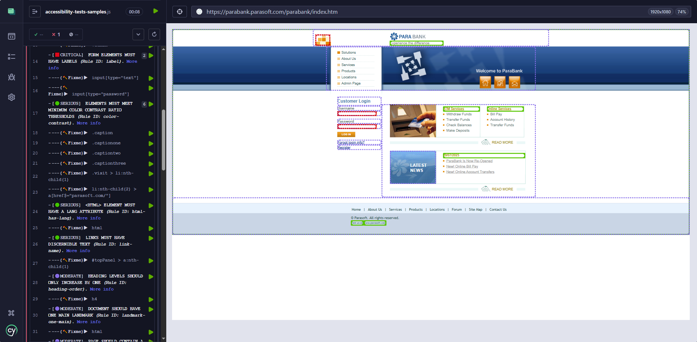

# wick-a11y

wick-a11y is a Cypress plugin designed for performing configurable accessibility tests using AXE. Leveraging both cypress-axe and axe-core, this plugin ensures your web applications meet accessibility standards by detecting violations and providing detailed reports.

With wick-a11y, you can easily incorporate accessibility checks into your End-to-End tests, logging detailed information in the Cypress log and generating HTML documents with screenshots of each violation for easier identification and resolution of accessibility issues.


## Main Features

- **Comprehensive Accessibility Analysis**: Leverages AXE-CORE for thorough accessibility checks.
  
- **Cypress Command**: Use the custom command `cy.checkAccessibility()` to run checks smoothly.

- **Configurable**: Customize to include specific impact levels, rules, and guidelines.

- **Detailed Violation Information**:
  - Displays violations in the Cypress log and browser console.
  - Graphically shows affected DOM elements on the page, enclosing them in a colored box based on severity.

- **Custom Styling**: Supports custom styling for accessibility issues based on severity level at the test level.

- **Interactive Console**:
  - Hovering over a specific violation in the Cypress log highlights the affected DOM element on the tested page, and clicking it displays detailed information about the issue in the browser console.
  - Hovering over a specific DOM element with a violation on the page in the Cypress runner highlights the element graphically and shows a tooltip with the violation information.

- **HTML Reports**: Generates HTML reports with the violations, including screenshots for visual reference.

> **Before launching the accessibility analysis, ensure what you want to analyze is fully rendered on the page.**
> 
> **The plugin analyzes DOM elements that are visible in the browser viewport as per the axe-core plugin (it will not include hidden elements).**


## Installation

```sh
npm install wick-a11y --save-dev
```


## Compatibility

- Compatible with all versions of Cypress v12.0.0 and greater.
- Relies on cypress-axe (≥ 1.5.0) and axe-core for accessibility analysis.


## Configuration

- First, in your **`cypress.config.js`** file import `wick-a11y/accessibility-tasks`, and add the line `addAccessibilityTasks(on)` within the **`setupNodeEvents`** function,  to include the accessibility tasks:

```javascript
const { defineConfig } = require("cypress");

// Import the accessibility tasks from wick-a11y plugin
const addAccessibilityTasks = require('wick-a11y/accessibility-tasks');

module.exports = defineConfig({
  e2e: {
    setupNodeEvents(on, config) {
      // Add accessibility tasks
      addAccessibilityTasks(on);
    },
    
    // ... rest of the configuration
  },
});
```

- Then import the custom commands in your **test file** or your **`cypress/support/e2e.js`** file:

```javascript
import 'wick-a11y';
```

- ✳️️  Accessibility HTML reports will be generated in the folder **`cypress/accessibility/`** by default. This folder can be changed by including the configuration parameter **`accessibilityFolder`** in **`cypress.config.js`**.

```javascript
module.exports = defineConfig({
  // ... rest of the configuration
  
  accessibilityFolder: 'cypress/your-accessibility-reports-folder/'
});
```


## API Reference

### cy.checkAccessibility(context, options)

Cypress custom command to check the accessibility of a given context using Axe-core. Only considers DOM elements that are visible on the screen. For details on parameters and options, refer to [AXE-Core Documentation](https://www.deque.com/axe/core-documentation/api-documentation/), [Axe-Core GitHub](https://github.com/dequelabs/axe-core), and [cypress-axe NPM](https://www.npmjs.com/package/cypress-axe).

- **`context`**: (optional) Defines the scope of the analysis. Can be a CSS Selector, a DOM Element, or an Object.
  When **context** is an Object, it could have the properties:
  
  - **`exclude`**: (optional) *From AXE-CORE* - Elements that should not be tested. Format: CSS Selector or Array of CSS selectors.
  
    E.g.1 `'button'` equivalent to `['button']`.
    
    E.g.2 `'input, .container, [data-cy="submission"]'` equivalent to `['input', '.container', '[data-cy="submission"]']`.

  - **`include`**: (optional) *From AXE-CORE* - Elements that should be tested. Format: CSS Selector or Array of CSS selectors.
  
    E.g. `'[data-cy="header"]'`
   
  - **`fromFrames`**: (optional) *From AXE-CORE* - An object with a fromFrames property to specify frames that should be tested.
   
  - **`fromShadowDom`**: (optional) *From AXE-CORE* - An object with a fromShadowDom property to specify shadow DOM elements that should be tested.
   
- **`options`**: (optional) Object with options to configure the accessibility check.
  
  - **`generateReport`**: (optional) *From WICK-A11Y* - Generate a detailed report.
  
    Default: `true`.

  - **`impactStyling`**: (optional) *From WICK-A11Y* - An object with an entry for each impact level you would like to override the plugin defaults ('critical', 'serious', 'moderate', 'minor').
  
    Each impact level entry may have two properties: 'icon', which specifies the icon to use for that type of violation in the Cypress runner, and 'style', which specifies the CSS style to apply to the HTML element bounding box showing the violation on the page.
    The styles passed in this option will override the default ones used by the plugin.
  
     Default styles:
     ```javascript
     {
          critical: { icon: '🟥', style: 'fill: #DE071B; fill-opacity: 0; stroke: #DE071B; stroke-width: 10;' },
          serious:  { icon: '🟧', style: 'fill: #FFA66A; fill-opacity: 0; stroke: #FFA66A; stroke-width: 10;' },
          moderate: { icon: '🟨', style: 'fill: #ECDE05; fill-opacity: 0; stroke: #ECDE05; stroke-width: 10;' },
          minor:    { icon: '🟦', style: 'fill: #4598FF; fill-opacity: 0; stroke: #4598FF; stroke-width: 10;' },
          fixme:    { icon: '🛠️'}
     }
     ```

  - **`includedImpacts`**: (optional) *From CYPRESS-AXE* - List of impact levels to include in the analysis. Possible impact values are 'minor', 'moderate', 'serious', or 'critical'.
  
    Default: `['critical', 'serious']`.
   
  - **`retries`**: (optional) *From CYPRESS-AXE* - Number of times to retry the check if there are initial findings.
  
    Default: `0`.
   
  - **`interval`**: (optional) *From CYPRESS-AXE* - Number of milliseconds to wait between retries.
  
    Default: `1000`.
   
  - **`runOnly`**: (optional) *From AXE-CORE* - List to specify which rules are executed.
  
    Default: `['wcag2a', 'wcag2aa', 'wcag21a', 'wcag21aa', 'best-practice']`.
   
    > ⚠️ **IMPORTANT:**  You must include all the rules (tags) that you want to execute in your analysis in this list. 
    > 
    > For example, if you want to run WCAG 2.1AA and all the previous versions of that standard (WCAG 2.0A, WCAG 2.0AA, WCAG 2.1A), you need to list them explicitly. Otherwise, only the rules specific to WCAG 2.1AA will be executed.
   
  - **`rules`**: (optional) *From AXE-CORE* - Enable or disable rules using the enabled property.

    E.g. `{ 'color-contrast': { enabled: false }, 'valid-lang': { enabled: false } }`.
   
  - **`reporter`**: (optional) *From AXE-CORE* - Which reporter to use.
    
    E.g. `'v2'`.
   
  - **`resultTypes`**: (optional) *From AXE-CORE* - Limit which result types are processed and aggregated. This can be useful for improving performance on very large or complicated pages when you are only interested in certain types of results.
    
    E.g. `['violations', 'incomplete', 'inapplicable']`.
   
  - **`selectors`**: (optional) *From AXE-CORE* - Return CSS selector for elements, optimized for readability.
  
    Default: `true`.
   
  - **`ancestry`**: (optional) *From AXE-CORE* - Return CSS selector for elements, with all the element's ancestors.
  
    Default: `false`.
   
  - **`xpath`**: (optional) *From AXE-CORE* - Return xpath selectors for elements.
  
    Default: `false`.
   
  - **`absolutePaths`**: (optional) *From AXE-CORE* - Use absolute paths when creating element selectors.
  
    Default: `false`.
   
  - **`iframes`**: (optional) *From AXE-CORE* - Tell axe to run inside iframes.
  
    Default: `true`.
   
  - **`elementRef`**: (optional) *From AXE-CORE* - Return element references in addition to the target.
  
    Default: `false`.
   
  - **`frameWaitTime`**: (optional) *From AXE-CORE* - How long (in milliseconds) axe waits for a response from embedded frames before timing out.
  
    Default: `60000`.
   
  - **`preload`**: (optional) *From AXE-CORE* - Any additional assets to preload before running rules.
  
    Default: `true`.
   
  - **`performanceTimer`**: (optional) *From AXE-CORE* - Log rule performance metrics to the console.
  
    Default: `false`.
   
  - **`pingWaitTime`**: (optional) *From AXE-CORE* - Time in milliseconds before axe-core considers a frame unresponsive.
  
    Default: `500`.


Example: Disable report, include only critical, serious, and moderate violations, and apply only the standards WCAG 2.0A, WCAG 2.0AA, and Best Practices.

```javascript
cy.checkAccessibility(null, {
  generateReport: false,
  includedImpacts: ['critical', 'serious', 'moderate'],
  runOnly: ['wcag2a', 'wcag2aa', 'best-practice']
});
```

Example: Use custom styles for accessibility violations with serious, moderate, and minor severity levels, and use a custom icon for "fixme". For critical violations, the default style will be used.

```javascript
const customImpactStyling = {
  serious:  { icon: '🟢', style: 'fill: #42C600; fill-opacity: 0; stroke: #42C600; stroke-width: 7;' },
  moderate: { icon: '🟣', style: 'fill: #886DE7; fill-opacity: 0.3; stroke: #886DE7; stroke-width: 6; stroke-dasharray: 5,3;' },
  minor:    { style: 'fill: #4598FF; fill-opacity: 0; stroke: #4598FF; stroke-width: 14; ' },
  fixme:    { icon: '🪓' }
 }

  cy.checkAccessibility(null, { impactStyling: customImpactStyling, includedImpacts: ['critical', 'serious', 'moderate', 'minor'] })
```


## Usage Examples

**Basic Usage**

In this basic usage example, the `cy.checkAccessibility()` function is called without parameters, so it will perform an accessibility analysis with the default configuration:

- Analyze the entire page document.
- Include elements with impact levels 'critical' and 'serious'.
- Run the rules for WCAG 2.0 Level A, WCAG 2.0 Level AA, WCAG 2.1 Level A, WCAG 2.1 Level AA, and best practices.
- Generate an HTML report for the identified violations.

> ⚠️ **Note:** Accessibility analysis can take some time, so it is recommended to increase the **`defaultCommandTimeout`** when running an accessibility test. You can configure this timeout either directly when defining the test or in your **`cypress.config.js`** file.
>
> **Also, before launching the accessibility analysis, ensure that what you want to analyze is fully rendered on the page. Only DOM elements that are visible in the browser viewport will be considered, as per the axe-core plugin (hidden elements will be ignored).**

```javascript
describe('Accessibility Test', () => {
  beforeEach(() => {
    cy.visit('http://example.com');
  });

  it('should check accessibility of the page', { defaultCommandTimeout: 15000 }, () => {
    cy.checkAccessibility();
  });
});
```

**Specify Context and Options Usage**

```javascript
describe('Accessibility Tests', { tags: ['@accessibility'] }, () => {
  beforeEach(() => {
    cy.visit('http://example.com');
  });

  it('Default analysis', { defaultCommandTimeout: 15000 }, () => {
    cy.checkAccessibility();
  });

  it('All levels of severity', { defaultCommandTimeout: 15000 }, () => {
    cy.checkAccessibility(null, { includedImpacts: ['critical', 'serious', 'moderate', 'minor'] });
  });

  it('Disable rules "contrast" and "valid-lang"', { defaultCommandTimeout: 15000 }, () => {
    cy.checkAccessibility(null, { rules: { 'color-contrast': { enabled: false }, 'valid-lang': { enabled: false } } });
  });

  it('Disable report generation', { defaultCommandTimeout: 15000 }, () => {
    cy.checkAccessibility(null, { generateReport: false, includedImpacts: ['critical', 'serious', 'moderate', 'minor'] });
  });

  it('Provide context as CSS selector and only best-practice', { defaultCommandTimeout: 15000 }, () => {
    cy.checkAccessibility(['div[role="banner"]', 'ul'], { includedImpacts: ['critical', 'serious', 'moderate', 'minor'], runOnly: ['best-practice'] });
  });

  it('Provide context as HTML Element and all levels of severity', { defaultCommandTimeout: 15000 }, () => {
    cy.document().then((doc) => {
      cy.checkAccessibility(doc.getElementById('my-navigation'), { includedImpacts: ['critical', 'serious', 'moderate', 'minor'] });
    });
  });

  it('Provide context as HTML NodeList', { defaultCommandTimeout: 15000 }, () => {
    cy.document().then((doc) => {
      cy.checkAccessibility(doc.querySelectorAll('div[role="banner"], ul'), { includedImpacts: ['critical', 'serious', 'moderate', 'minor'] });
    });
  });

  it('Provide context as "exclude" and "include"', { defaultCommandTimeout: 15000 }, () => {
    cy.checkAccessibility({ exclude: 'li', include: 'li:nth-child(2)' }, { includedImpacts: ['critical', 'serious', 'moderate', 'minor'] });
  });

  it('Custom colors by severity', {defaultCommandTimeout: 15000}, () => {
    const customImpactStyling = {
        critical: { icon: '🔴', style: 'fill: #DE071B; fill-opacity: 0; stroke: #DE071B; stroke-width: 10;' },
        serious:  { icon: '🟢', style: 'fill: #42C600; fill-opacity: 0; stroke: #42C600; stroke-width: 7;' },
        moderate: { icon: '🟣', style: 'fill: #886DE7; fill-opacity: 0.3; stroke: #886DE7; stroke-width: 6; stroke-dasharray: 5,3;' },
        minor:    { icon: '🔵', style: 'fill: #4598FF; fill-opacity: 0; stroke: #4598FF; stroke-width: 14; ' },
        fixme:    { icon: '🪓' }
    }

    cy.checkAccessibility(null, { impactStyling: customImpactStyling, includedImpacts: ['critical', 'serious', 'moderate', 'minor'] })
  });
});
```


## Results

All the accessibility violations are shown in the Cypress log, ordered by severity, and are also graphically highlighted on the page, enclosed in a bounding box colored according to the severity level.

Styles by default: Critical 🟥, Serious 🟧, Moderate 🟨, Minor 🟦

If there are any violations for the selected rules used in the analysis, the test will fail.


### Violation Details in Browser Console from Cypress Log

To identify, in the page, which HTML element is affected by an accessibility violation, mouseover the specific violation in the Cypress log, and that element will be highlighted on the page. To know the details about the accessibility issue, click on the violation in the Cypress log and those details will be shown in the browser console.


### Violation Details in Tooltip when Hovering over a DOM Element on the Page

When hovering over a specific DOM element with a violation on the page in the Cypress runner, the element will be highlighted graphically, and a tooltip will appear showing the violation information. This feature allows you to quickly identify and understand accessibility issues directly on the page, providing an immediate and intuitive way to address them.


### HTML Report

When the option **`generateReport`** is true (which is the default setting), an HTML report with all the accessibility violation details will be generated. By default, accessibility HTML reports are created in the `cypress/accessibility/` folder. You can customize this location by setting the `accessibilityFolder` parameter in your `cypress.config.js` configuration file.

For each test that checks accessibility using the `cy.checkAccessibility()` command, a directory will be created in the accessibility folder.

The directory will be named in the following format:

**`Accessibility Report --- <testSpecFile> --- <testName> (<reportDate>)`**


Within the newly created test folder, you will find two files:

- `Accessibility Report.html` - This file contains the complete accessibility report, detailing the violations for that specific test.
- `Accessibility Issues Image.png` - This file includes a screenshot of the issues for visual reference.

The image file is also referenced within the HTML report.


In the report, accessibility issues are ordered by severity, and at the end of the report, an image with a screenshot of the page with the violations colored based on severity is included.


More details on how to fix each of those violations can be seen by hovering over them in the HTML report.


> ✔️ **Note:** The HTML accessibility report generated by the plugin complies with all severity levels—critical, serious, moderate, and minor. It also adheres to the tags wcag2a, wcag2aa, wcag21a, wcag21aa, and best-practice.

### Custom Styles Based on Severity (Cypress runner and HTML Report)

Configured custom styles displayed in the Cypress runner:



Same custom styles shown in the HTML report:


## License

MIT License. See the [LICENSE](LICENSE) file for more details.


## Changelog

### v1.1.1

- Fix issue regarding highlighting violation when hovering in the cypress runner during the analysis screenshot 
- Fix reported issue when multiple retries are enabled https://github.com/sclavijosuero/wick-a11y/issues/2

### v1.1.0

- Implemented tooltip with violations details when hovering over DOM Element in the Cypress runner
- Change color highlighted DOM elements from the Cypress log to match color used when hovering.

### v1.0.1

- Fix typo in README.md

### v1.0.0

- Initial release with core functionalities.
- Comprehensive configuration options for AXE analysis.
- Detailed logging and report generation for accessibility violations.
